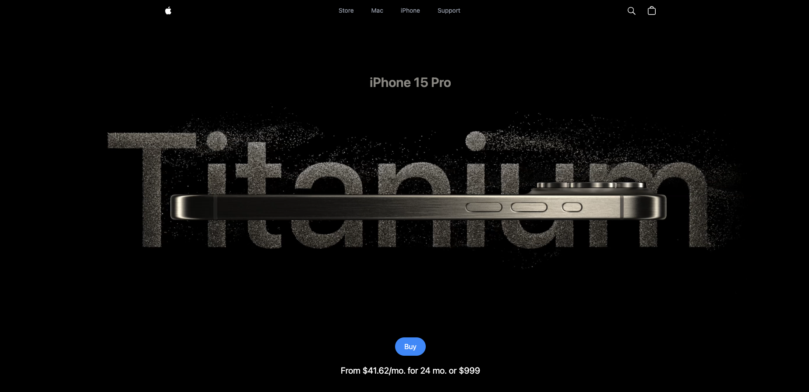

# iPhone 3D Website - React, Three.js, GSAP & Tailwind

A modern 3D iPhone showcase website built with React, TypeScript, Three.js, GSAP animations, and Tailwind CSS.



## Features

- Interactive 3D iPhone model using Three.js
- Smooth animations with GSAP
- Responsive design with Tailwind CSS
- Type-safe React components with TypeScript
- Scroll-triggered animations

## Technologies Used

- [React](https://reactjs.org/) (with TypeScript)
- [Three.js](https://threejs.org/) - 3D rendering library
- [GSAP](https://greensock.com/gsap/) - Animation library
- [Tailwind CSS](https://tailwindcss.com/) - Utility-first CSS framework
- [Vite](https://vitejs.dev/) - Build tool

## Credits

This project is a TypeScript rewrite of the original JavaScript implementation by [https://github.com/adrianhajdin].  
Original project: [https://github.com/adrianhajdin/iphone/]

## Installation

```bash
# Clone the repository
git clone [repository-url]

# Install dependencies
npm install
# or
yarn install

# Start development server
npm run dev
# or
yarn dev

# Build for production
npm run build
# or
yarn build